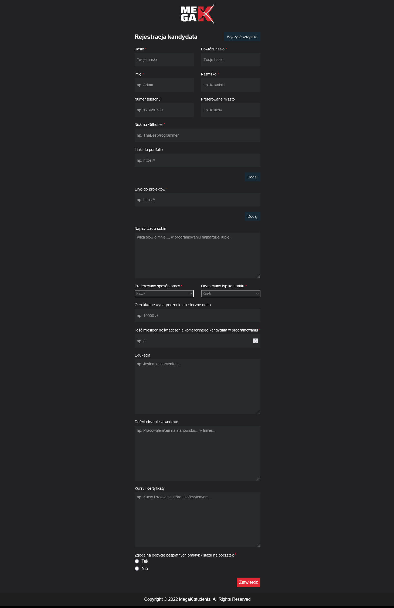

# MegaK Head Hunter

> MegaK Head Hunter is a final project - website build by MegaK course students.

- As a recruiter you can:

  - select developers of your choice.
  - store up to 10 people you would like to hire.
  - set filters to meet your expectations easier.

- As a developer:
  - create your profile.
  - set up links to your portfolio.
  - choose expectations about your employment.

## Table of Contents

- [Technologies Used](#technologies-used)
- [Screenshots](#screenshots)
- [Setup](#setup)
- [Project Status](#project-status)
- [Room for Improvement](#room-for-improvement)
- [License](#license)
- [Contact](#contact)

## Technologies Used

- [![React][react.js]][react-url]
- [![React Router][reactrouter.com]][reactrouter-url]
- [![React Redux][react-redux.js.org]][reactredux-url]
- [![SCSS][sass-lang.com]][scss-url]
- [![Typescript][typescript.com]][typescript-url]

## Screenshots

## Setup

### Getting Started with Create React App

This project was bootstrapped with [Create React App](https://github.com/facebook/create-react-app).

### Available Scripts

In the project directory, you can run:

#### `npm start`

Runs the app in the development mode.\
Open [http://localhost:3000](http://localhost:3000) to view it in the browser.

The page will reload if you make edits.\
You will also see any lint errors in the console.

#### `npm test`

Launches the test runner in the interactive watch mode.\
See the section about [running tests](https://facebook.github.io/create-react-app/docs/running-tests) for more information.

#### `npm run build`

Builds the app for production to the `build` folder.\
It correctly bundles React in production mode and optimizes the build for the best performance.

The build is minified and the filenames include the hashes.\
Your app is ready to be deployed!

See the section about [deployment](https://facebook.github.io/create-react-app/docs/deployment) for more information.

#### `npm run eject`

**Note: this is a one-way operation. Once you `eject`, you can’t go back!**

If you aren’t satisfied with the build tool and configuration choices, you can `eject` at any time. This command will remove the single build dependency from your project.

Instead, it will copy all the configuration files and the transitive dependencies (webpack, Babel, ESLint, etc) right into your project so you have full control over them. All of the commands except `eject` will still work, but they will point to the copied scripts so you can tweak them. At this point you’re on your own.

You don’t have to ever use `eject`. The curated feature set is suitable for small and middle deployments, and you shouldn’t feel obligated to use this feature. However we understand that this tool wouldn’t be useful if you couldn’t customize it when you are ready for it.

## Project Status

Project is: _in progress_

## Room for Improvement

- implement Formik and Yup for handling reservation form

## License

This website was built by MegaK students.
Copyright @ 2022 MegaK students. All Rights Reserved.
You are allowed to use it for both personal and commercial use, but not to claim it as your own design.

## Contact

Created by:

[@Wiolinek](https://github.com/Wiolinek) \
[@TheLocagus](https://github.com/TheLocagus)

feel free to contact us!

[react.js]: https://img.shields.io/badge/-React-9cf
[react-url]: https://reactjs.org/
[reactrouter.com]: https://img.shields.io/badge/-React%20Router-orange
[reactrouter-url]: https://reactrouter.com/
[react-redux.js.org]: https://img.shields.io/badge/-React%20Redux-purple
[reactredux-url]: https://react-redux.js.org/
[sass-lang.com]: https://img.shields.io/badge/-SCSS-pink
[scss-url]: https://sass-lang.com/
[typescript.com]: https://img.shields.io/badge/-Typescript-blue
[typescript-url]: https://www.typescriptlang.org/
